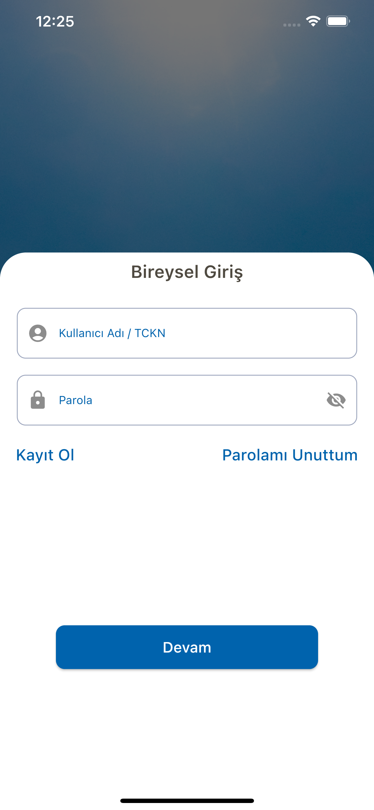
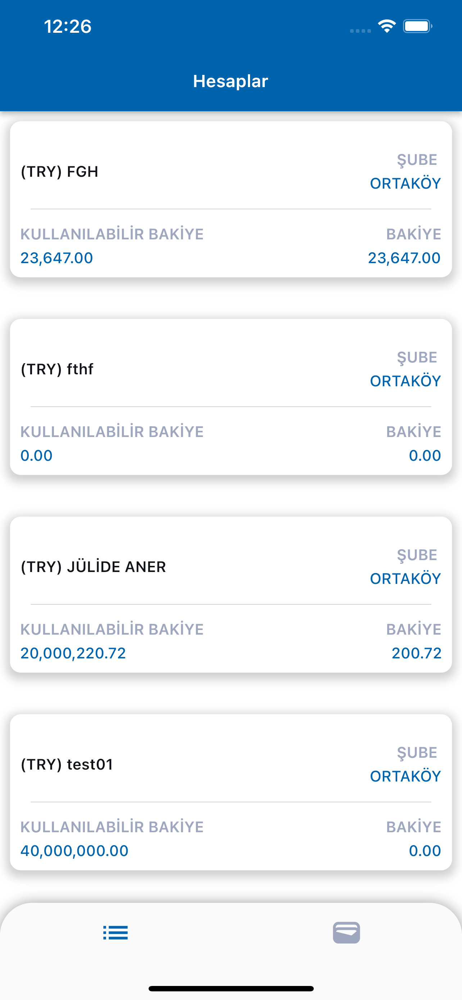
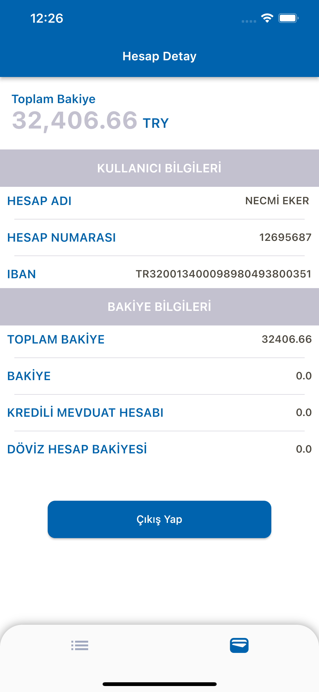

# Flutter - Mobile Case INTERTECH

## Ekran Görünleri

### Giriş Ekranı

### Hesaplar

### Hesap Detay

## Neler Eklendi :question:

- [x] Giriş Ekranı
- [x] Hesap Detay Ekranı
- [x] Hesaplar Ekranı
- [x] State Management (Provider)
- [x] Unit Test

## Kullanılan Paketler

 #### Utilty
 -json_annotation,json_serializable,intl

 #### Widget
 -another_flushbar

 #### State Management
 -provider

 #### Cache
 -hive,hive_flutter
 
#### Network
 -vexana